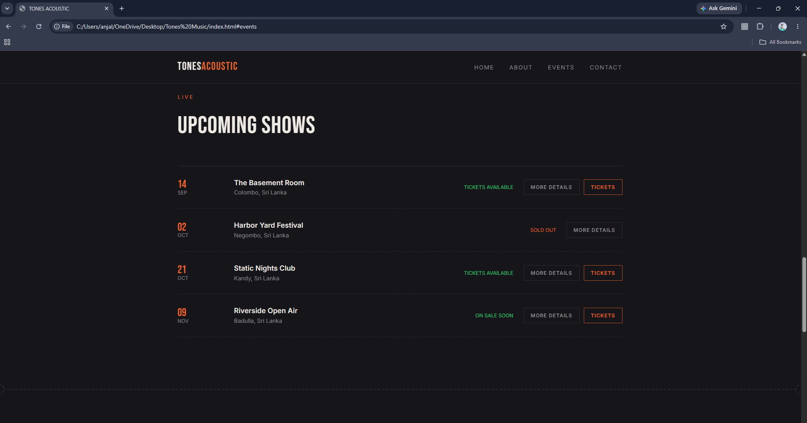

#  TONES ACOUSTIC - Official Music Band Website

A sleek, modern, dark-themed responsive website developed for **TONES ACOUSTIC**, an eight-piece acoustic collective based in Bandarawela, Sri Lanka. Built using core front-end web technologies (HTML5, CSS3, JavaScript), this platform serves as the central hub for fans and event organizers to explore the band's story, check upcoming tour schedules, view event details, and handle booking inquiries.

---

## 📸 Project Showcase & Screenshots

<details open>
  <summary><b> 1. Landing Page & Hero Section</b></summary>
  <br/>

  | Hero / Home Page |
  | :---: |
  |  |

</details>

<br/>

<details open>
  <summary><b> 2. About the Band & Musical Journey</b></summary>
  <br/>

  | Band Overview & Lineup | Our Story & Musical Journey |
  | :---: | :---: |
  |  |  |

</details>

<br/>

<details open>
  <summary><b> 3. Live Shows, Events & Ticket Details</b></summary>
  <br/>

  | Upcoming Shows & Schedule | Event Details View |
  | :---: | :---: |
  |  |  |

</details>

<br/>

<details open>
  <summary><b> 4. Contact & Booking Inquiry</b></summary>
  <br/>

  | Contact & Booking Form |
  | :---: |
  |  |

</details>

---

## ✨ Key Features & Highlights

-  Modern Dark Aesthetic: Elegant typography with high-contrast accent colors tailored specifically for live music bands and acoustic acts.
-  Deep Dive Band Story: Comprehensive overview section highlighting the 8-piece acoustic setup, history, origin story, and lineup.
-  Dynamic Events & Tour Dates: Shows upcoming tour schedules with live status indicators (*Tickets Available*, *Sold Out*, *On Sale Soon*).
-  Detailed Event Page:** Dedicated event view detailing venue info, date, time, pricing, and event descriptions.
-  Interactive Booking Form: Built-in client-side validation ensuring name, email, and message inputs are provided before submission.
-  Responsive Layout: Optimized navigation and display layout across desktops, tablets, and mobile devices.

---

## 🛠️ Tech Stack Used

-  Markup Language: HTML5
-  Styling & Layout: CSS3 (Custom Styles, Flexbox, Grid)
-  Scripting & Interactivity: JavaScript

---

## 🚀 How to Run Locally

Since this is a lightweight static front-end project, **no local server environment (like XAMPP, WAMP, or Node.js) is required**.

1. **Clone or Download the Repository:**
   ```bash
   git clone [https://github.com/YourUsername/Tones-Acoustic-Website.git](https://github.com/YourUsername/Tones-Acoustic-Website.git)
